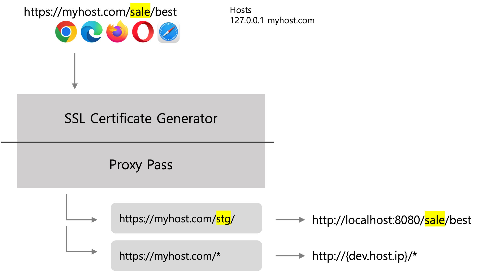

# gotpache(갖바치 - 갖신'의 장인)

Development utility - act as apache proxypass and generates its own ssl certificates for sites.

Gotpache는 개발/테스트환경에서 apache의 ProxyPass 기능과 SSL인증서를 간편하게 사용하기 위해서 개발한 프로그램입니다.
apache/nginx의 복잡한 기능을 가지고 있지 않지만, ProxyPass와 유사한 기능과 SSL인증서를 동적으로 생성하는 기능을 제공합니다.
개발/테스트환경에서 프로그램 실행만으로 복잡한 인증서문제를 해결할 수 있습니다.
또한 최근 HTTPS를 적용하면서 강화되는 samesite와 같은 보안 이슈를 gotpache를 통해 간단하게 구성하고 테스트할 수 있습니다. 

## 사용방법
1. gotpache.x.x.x.zip은 다운로드 받아 압축을 해제
2. gotpache.bat 또는 gotpache.sh를 실행(JAVA_HOME 설정 필요)
3. conf 경로 생성된 ROOT 인증서 확인(*.cer)
4. cer 파일을 더블클릭하여 시스템에 ROOT 인증서 설치(구글링-ROOT 인증서 설치)
5. 로컬 hosts 파일에서 도메인 변경( ex. 127.0.0.1 foo.com, 127.0.0.1 foo2.com)
6. conf/proxypass.properties - URL 패턴에 따른 서버 분기 설정(로컬/원격 관계없음)
7. 브라우저에서 https://foo.com 접속 (실시간으로 foo.com 인증서 생성)
8. 브라우저에서 https://foo2.com 접속 (실시간으로 foo2.com 인증서 생성)

## 소스관련
코드를 계속업데이트하기 힘들지도 몰라서 최대한 단순하게 작성했습니다.
지금 개발환경에서 사용하는데 큰 문제가 없어서 HTTP 1.0만 구현하고 있습니다.
상위버전은 아직 계획이 없고, 필요하신 분들은 자유롭게 수정해서 사용하셔도 됩니다.
